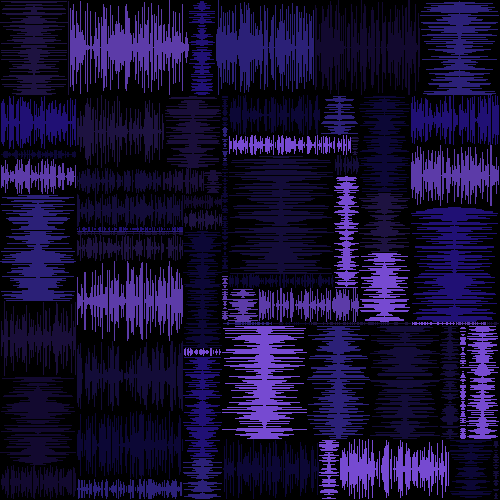

# Mondrian-Static
I developed an interactive random art generator using recursion. It creates geometric patterns inspired by Piet Mondrian, as well as more complex, stylized variants resembling static or waveforms. The project demonstrates algorithmic design, procedural generation, and randomness, showcasing my skills in recursion and dynamic pattern creation.

## Included Files:
* Mondrian.java
  * contains algorithm for Mondrian art generation
* Client.java
  * provides a more user-friendly guide in generating Mondrian art from various variant and size options
* Picture.java
  * contains supporting code for creating and displaying images
* smondrian-static.gif
  * fun little animation
